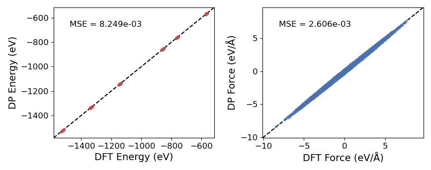
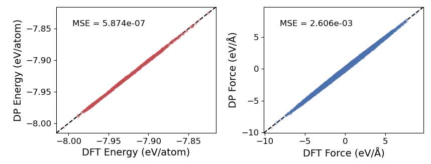
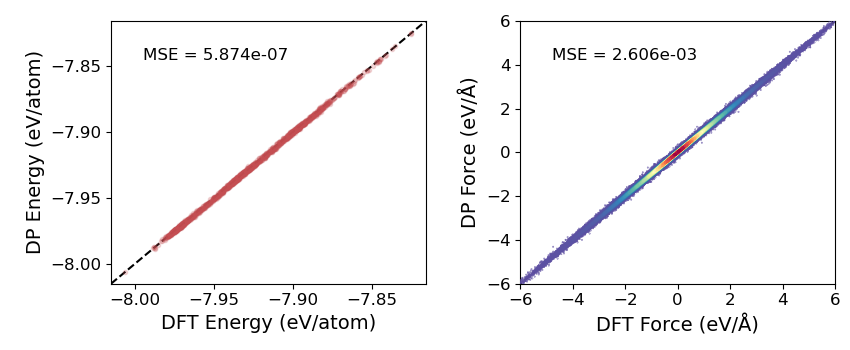

======
parity
======

The ``dptools parity`` command is used to create parity plots for comparing DP energy and force
predictions with DFT values.

.. warning::

   Parity plots can be deceiving! Just because your parity plots look good does not mean
   you have a good model. Model ensembles are much more reliable for checking how well
   your model has sampled the relevant phase space of your system(s).

General usage,

.. code-block:: console

   $ dptools parity [-h] [-m MODEL] [-l {mse,mae,rmse}] [-s file_name] [-r] [--per-atom] [--xyz] [--fancy] [system ...]

.. code-block:: bash

   positional arguments:
     system                Paths to deepmd-kit dataset folders, .traj, .db, etc. (default: None)
   
   optional arguments:
     -h, --help            show this help message and exit
     -m MODEL, --model MODEL
                           Specify path of frozen .pb deepmd model to use (default: ./graph.pb)
     -l {mse,mae,rmse}, --loss-function {mse,mae,rmse}
                           Type of loss function to display for parity plot error (default: mse)
     -s file_name, --save-plot file_name
                           Name of file (with extension) to save parity plot to. (default: None)
     -r, --rasterized      Rasterize plot data to reduce size of file (default: False)
     --per-atom            Normalize energies per number of atoms (default: False)
     --xyz                 Plot each xyz force component separately (default: False)
     --fancy               Create fancy density heat map for forces parity plot (default: False)

Quick reference examples
------------------------

.. code-block:: console

   $ dptools parity
   $ dptools parity /path/to/dataset/system*/test/set*
   $ dptools parity -m ../old_graph.pb test_set.traj
   $ dptools parity -l mae --per-atom
   $ dptools parity -l mae --fancy --xyz

Create parity plot for test sets
--------------------------------

If you run,

.. code-block:: console
    
   $ dptools parity

with no additional arguments while in a directory that was used for training a deepmd model
(i.e., the working directory should contain a graph.pb file and in.json), dptools will check
the in.json file for all systems used for training, and create parity plots for the
corresponding test sets located in the dataset folder.

The typical output should look something like,

If your energy values span a large range like the image above, you may consider plotting
the energy per atom with the ``--per-atom`` flag.

.. code-block:: console

   $ dptools parity --per-atom

Create parity plot from ASE/DFT output
--------------------------------------

If you have for example several DFT single point calculations saved in a .traj file or similar,
you can provide the path to the file as an optional last argument,

.. code-block:: console

   $ dptools parity dft_single_points.traj

Note that you must be located in the directory with your trained graph.pb file, or provide the path
like,

.. code-block:: console

   $ dptools parity -m /path/to/my_graph.pb dft_single_points.traj

Create density heat map for forces parity plot
----------------------------------------------

A prettier version of the parity plot with a color map representing the density of force predicitons
can be created with for example,

.. code-block:: console

   $ dptools parity --per-atom --fancy

Additional options
------------------

By default, the mean-squared error (MSE) of the predictions is displayed on the parity plot. You
can change this to MAE or RMSE with the ``-l`` or ``--loss-function`` flag,

.. code-block:: console

   $ dptools parity -l mae

You can also choose to plot the 3 force components (Fx, Fy, Fz) separately,

.. code-block:: console

   $ dptools parity --xyz

.. note::

   Plotting each force component separately is typically unnecessary as the error of the force
   predictions will be similar for all directions, leading to redundant plots. However, for some
   systems (such as when one dimension of your system's unit cell is significantly smaller, e.g.,
   x << y and z), you may see some discrepency between the accuracy of each direction's force
   prediction, and it might make sense to plot them separately.

If you want to save the resulting plots to a file as opposed to opening the display, specify
``-s`` or ``--save-plot`` with the name of the file like,

.. code-block:: console

   $ dptools parity -s parity.png

If you're saving to a vector graphics format (.pdf, .svg, etc.) and you have a lot of data,
you probably want to rasterize (``-r`` or ``--rasterized``) the image to reduce the file
size/loading times,

.. code-block:: console

   $ dptools parity -r -s parity.pdf
