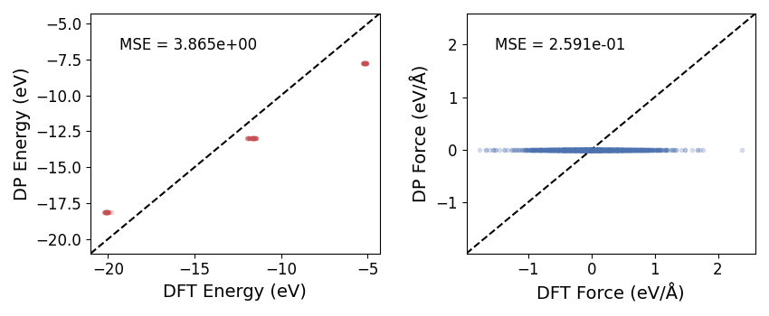
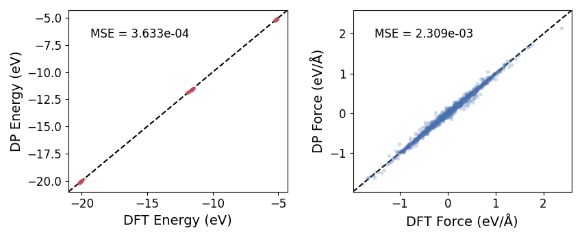

My parity plot is horizontal, how do I fix that?
=========================================================================

If your parity plots look something this like (i.e., constant DP predictions):

You should try decreasing the initial learning rate (``start_lr`` in the
in.json training parameter file).

For example, changing ``start_lr=0.001`` (above image) to ``start_lr=0.0003`` resulted in:

Success! But you'll need to play around with it for your system(s).
