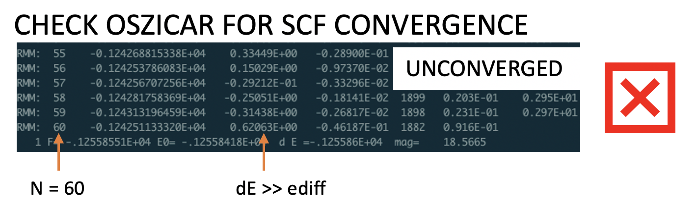
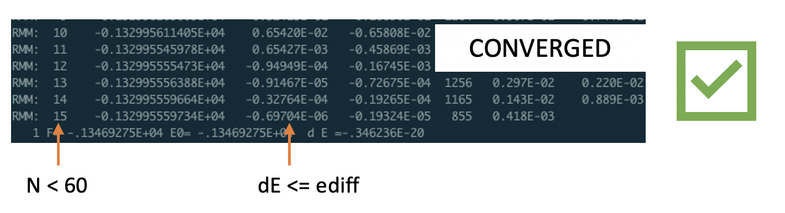

How do I know if my DFT calculation converged?
==============================================

.. important::
   DO NOT TRAIN ON UNCONVERGED DFT RESULTS. YOU NEED TO CHECK YOUR CALCULATIONS FOR
   CONVERGENCE BEOFRE INCLUDING THEM IN TRAINING!!!! You will likely need to restart
   everything if you discover you have been training on unconverged calculations.

For VASP calculations, you can check the OSZICAR file and see how many scf (inner loop)
steps were completed. If the maximum number of steps (NELM in INCAR, default is 60) was
reached, then the calculation is unconverged. If the dE column value is a very small number
(close to EDIFF in INCAR), then it might still be usable. But I would just toss it out anyway.

This is an example of unconverged results (NELM=60):

This is an example of converged results:

Here is a python function you can use for reading OSZICAR. Call it after you run DFT
single point calculations, and if False is returned, delete the calculation results.

.. code-block:: python

    def check_convergence(oszicar, nelm=60):
        """Checks VASP OSZICAR for convergence.

        Args:
            oszicar (str): Path to VASP OSZICAR file
            nelm (int): NELM parameter in INCAR

        Returns:
            bool: True if converged, else False
        """
        with open(oszicar) as file:
            line = [l for l in file if 'RMM' in l or 'DAV' in l][-1]
        try:
            n = int(line.split()[1])
        except:
            print('failed')
            return False
        if n == nelm:
            print('unconverged')
            return False
        return True
